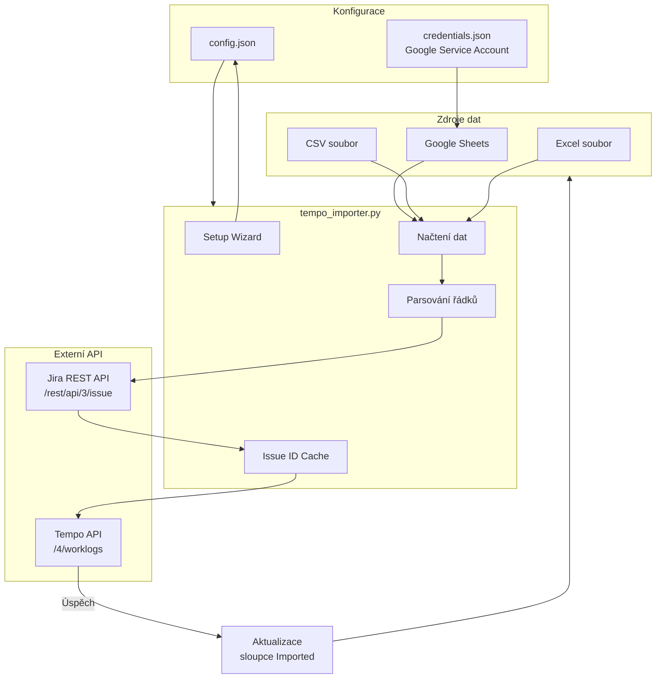
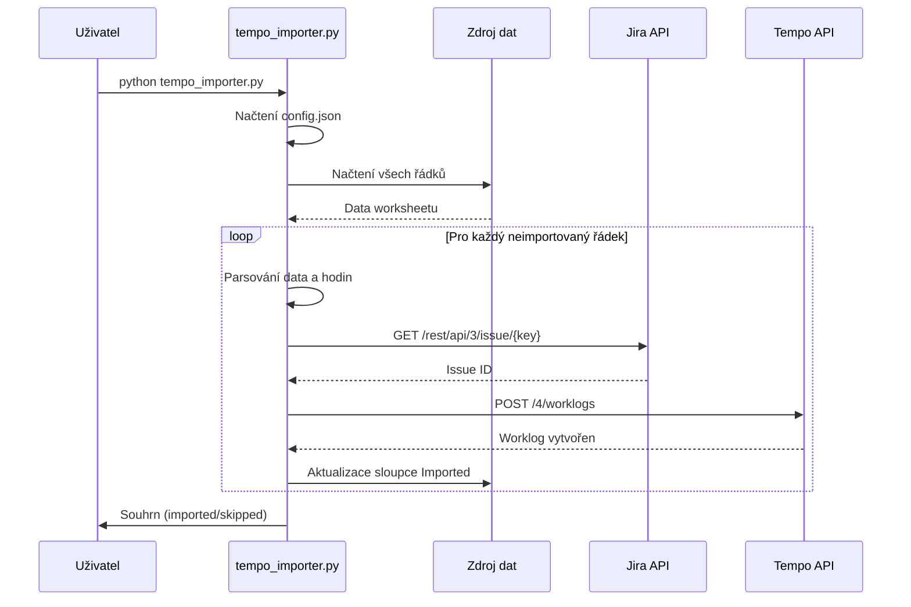

# Jira Tempo Importer

Import časových záznamů z Google Sheets nebo lokálních souborů (CSV, Excel) do Tempo (Jira).

## Architektura



## Sekvenční diagram importu



## Struktura worksheetu

| A - Datum | B - Task ID | C - Description | D - Hodiny | E - Imported |
|-----------|-------------|-----------------|------------|--------------|
| 1.12.     | PROJ-123    | Popis práce     | 2.5        |              |
| 2.12.     | PROJ-456    | Další práce     | 4.0        | 02.12.2024   |

- **Datum**: formát `d.m.` (např. `1.12.`, `15.1.`)
- **Task ID**: Jira ticket key (např. `PROJ-123`)
- **Description**: Popis práce
- **Hodiny**: Počet hodin (desetinná čárka nebo tečka)
- **Imported**: Prázdné = k importu, vyplněné = již importováno

## Instalace

```bash
# Vytvořit virtual environment
python3 -m venv venv
source venv/bin/activate

# Nainstalovat závislosti
pip install -r requirements.txt
```

## První spuštění

Při prvním spuštění se spustí interaktivní setup wizard, který vás provede konfigurací:

```bash
python tempo_importer.py
```

Wizard se vás zeptá na:
1. **Jira URL** a přihlašovací údaje (email + API token)
2. **Tempo API token**
3. **Zdroj dat** - Google Sheets nebo lokální soubor (CSV/Excel)

Konfigurace se uloží do `config.json` a při dalším spuštění se použije automaticky.

## Použití

```bash
# Aktivovat venv
source venv/bin/activate

# Normální import
python tempo_importer.py

# Dry run - ukáže co by se importovalo (bez změn)
python tempo_importer.py --dry-run

# Použít jiný soubor (jednorázově)
python tempo_importer.py --file /cesta/k/souboru.xlsx

# Znovu spustit setup wizard
python tempo_importer.py --setup
```

## Podporované formáty

- **Google Sheets** - vyžaduje service account credentials
- **CSV** - automatická detekce oddělovače (`,`, `;`, tab)
- **Excel** - `.xlsx`, `.xls`, `.xlsm`

## Získání API tokenů

### Tempo API Token
1. Jděte do Tempo → Settings (ozubené kolečko)
2. API Integration → New Token
3. Zkopírujte token

### Jira API Token
1. Jděte na https://id.atlassian.com/manage-profile/security/api-tokens
2. Create API token
3. Zkopírujte token

### Google Sheets (volitelné)
1. Jděte na [Google Cloud Console](https://console.cloud.google.com/)
2. Vytvořte nový projekt
3. APIs & Services → Enable APIs → "Google Sheets API"
4. APIs & Services → Credentials → Create Credentials → Service Account
5. Po vytvoření klikněte na service account → Keys → Add Key → JSON
6. Stáhněte JSON soubor
7. **Důležité**: Sdílejte váš Google Sheet s emailem service accountu (najdete v JSON jako `client_email`)
