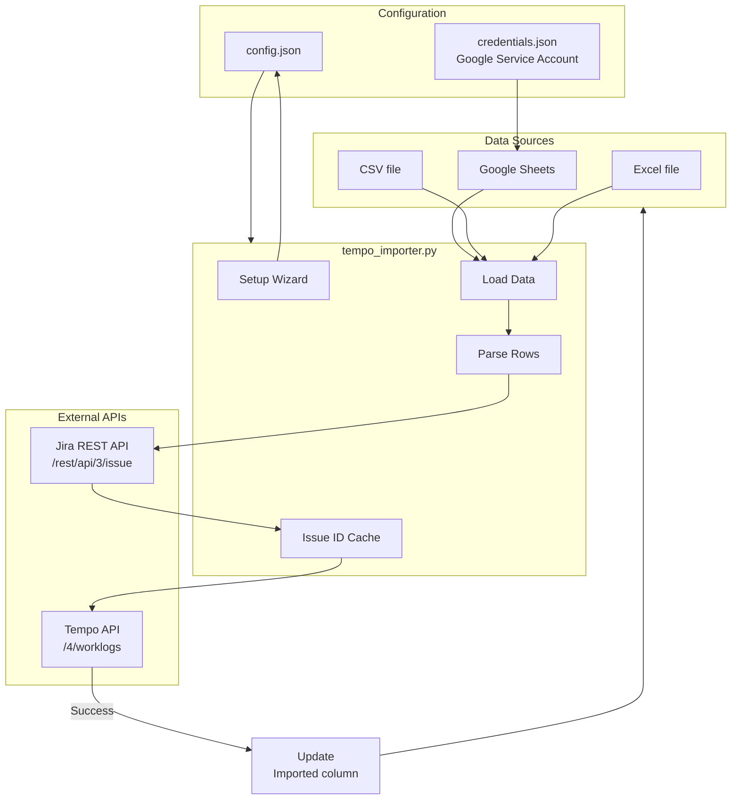
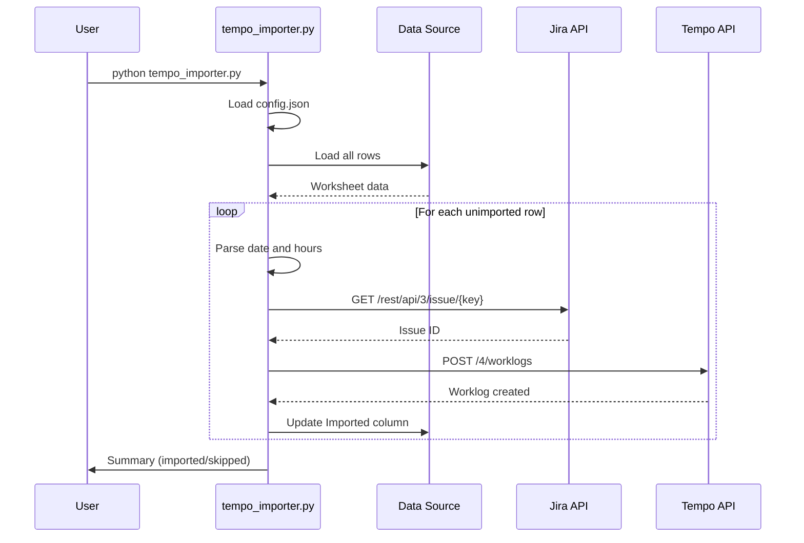

# Jira Tempo Importer

Import time entries from Google Sheets or local files (CSV, Excel) to Tempo (Jira).

## Architecture



## Import Sequence Diagram



## Worksheet Structure

The tool always uses the **first worksheet** in the file (for Google Sheets and Excel).

| A - Date | B - Task ID | C - Description | D - Hours | E - Imported |
|----------|-------------|-----------------|-----------|--------------|
| 1.12.    | PROJ-123    | Work description | 2.5      |              |
| 2.12.    | PROJ-456    | More work        | 4.0      | 02.12.2024   |

- **Date**: format `d.m.` (e.g., `1.12.`, `15.1.`)
- **Task ID**: Jira ticket key (e.g., `PROJ-123`)
- **Description**: Work description
- **Hours**: Number of hours (decimal comma or point)
- **Imported**: Empty = to be imported, filled = already imported

## Installation

```bash
# Create virtual environment
python3 -m venv venv
source venv/bin/activate

# Install dependencies
pip install -r requirements.txt
```

## First Run

On first run, an interactive setup wizard will guide you through configuration:

```bash
python tempo_importer.py
```

The wizard will ask for:
1. **Jira URL** and credentials (email + API token)
2. **Tempo API token**
3. **Data source** - Google Sheets or local file (CSV/Excel)

Configuration is saved to `config.json` and reused automatically on subsequent runs.

## Usage

```bash
# Activate venv
source venv/bin/activate

# Normal import
python tempo_importer.py

# Dry run - shows what would be imported (no changes)
python tempo_importer.py --dry-run

# Use a different file (one-time)
python tempo_importer.py --file /path/to/file.xlsx

# Re-run setup wizard
python tempo_importer.py --setup
```

## Supported Formats

- **Google Sheets** - requires service account credentials (uses first worksheet)
- **CSV** - automatic delimiter detection (`,`, `;`, tab)
- **Excel** - `.xlsx`, `.xls`, `.xlsm` (uses first worksheet)

## Getting API Tokens

### Tempo API Token
1. Go to Tempo → Settings (gear icon)
2. API Integration → New Token
3. Copy the token

### Jira API Token
1. Go to https://id.atlassian.com/manage-profile/security/api-tokens
2. Create API token
3. Copy the token

### Google Sheets (optional)
1. Go to [Google Cloud Console](https://console.cloud.google.com/)
2. Create a new project
3. APIs & Services → Enable APIs → "Google Sheets API"
4. APIs & Services → Credentials → Create Credentials → Service Account
5. After creation, click on the service account → Keys → Add Key → JSON
6. Download the JSON file
7. **Important**: Share your Google Sheet with the service account email (found in JSON as `client_email`)

## License

MIT License - see [LICENSE](LICENSE) file.
